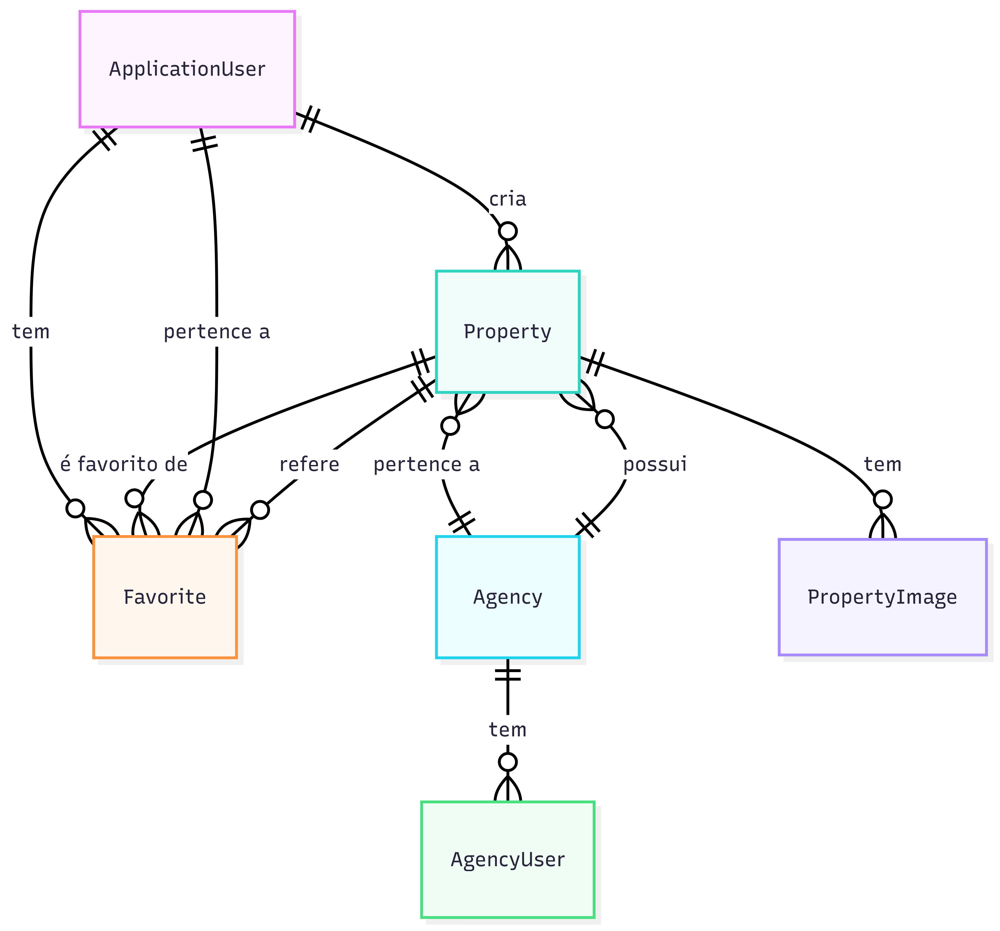

# 🔧 Manual Técnico — ImoSphere

> **Documentação técnica completa para desenvolvedores e administradores de sistema**

## 📋 Índice

- [🏗️ Arquitetura](#️-arquitetura)
- [🗄️ Base de Dados](#️-base-de-dados)
- [📁 Estrutura do Projeto](#-estrutura-do-projeto)
- [🔧 Configuração](#-configuração)
- [🚀 Desenvolvimento](#-desenvolvimento)
- [🔌 APIs e Endpoints](#-apis-e-endpoints)
- [🔐 Autenticação e Autorização](#-autenticação-e-autorização)
- [📊 Migrações](#-migrações)
- [🐛 Troubleshooting](#-troubleshooting)

## 🏗️ Arquitetura

### Stack Tecnológico
- **Framework**: ASP.NET Core 8.0 MVC
- **ORM**: Entity Framework Core 8.0
- **Base de Dados**: SQLite (desenvolvimento) / SQL Server (produção)
- **Autenticação**: ASP.NET Core Identity
- **Comunicação Real-time**: SignalR
- **Frontend**: Bootstrap 5.3, jQuery, Font Awesome
- **Design Responsivo**: Interface moderna, com modo claro (fundo branco, texto preto, cartões brancos, roxo claro, header/footer escuros) e modo escuro (fundo escuro, texto claro, cartões escuros). O utilizador pode alternar facilmente entre os modos, garantindo sempre excelente contraste, acessibilidade e conforto visual.
- **Mapas**: Leaflet.js + OpenStreetMap

### Padrões Arquiteturais
- **MVC (Model-View-Controller)**: Separação clara de responsabilidades
- **Repository Pattern**: Abstração da camada de dados
- **Dependency Injection**: Injeção de dependências nativa do ASP.NET Core
- **Identity Framework**: Gestão de utilizadores e roles

## 🗄️ Base de Dados

### Esquema Principal

#### Tabelas de Utilizadores (Identity)
```sql
-- Tabelas padrão do ASP.NET Core Identity
AspNetUsers          -- Utilizadores do sistema
AspNetRoles          -- Roles (SuperAdmin, Admin, Comercial, User)
AspNetUserRoles      -- Relação utilizador-role
AspNetUserClaims     -- Claims dos utilizadores
AspNetUserLogins     -- Logins externos
AspNetUserTokens     -- Tokens de autenticação
AspNetRoleClaims     -- Claims das roles
```

#### Tabelas de Negócio
```sql
Agencies             -- Agências imobiliárias
AgencyUsers          -- Relação utilizador-agência
Properties           -- Propriedades imobiliárias
PropertyImages       -- Imagens das propriedades
Messages             -- Sistema de mensagens
```

### Relacionamentos
- **AgencyUsers**: N:N entre Users e Agencies
- **Properties**: N:1 com Agencies e Users (CreatedBy)
- **PropertyImages**: N:1 com Properties
- **Messages**: N:1 com Users (Sender/Receiver)

### DER e MER do Sistema

O diagrama seguinte representa as principais entidades do sistema e os seus relacionamentos:


**Entidades e Relações:**
- **ApplicationUser**: Utilizador do sistema (herda de IdentityUser)
- **Agency**: Agência imobiliária
- **Property**: Imóvel
- **PropertyImage**: Imagem de imóvel
- **Favorite**: Favorito (ligação entre utilizador e imóvel)
- **AgencyUser**: Relação N:N entre utilizador e agência

**Relações principais:**
- Uma agência tem vários imóveis e vários utilizadores (AgencyUser)
- Um imóvel pertence a uma agência e pode ter várias imagens
- Um imóvel é criado por um utilizador
- Um utilizador pode ter vários favoritos (imóveis)
- Um favorito liga um utilizador a um imóvel

## 📁 Estrutura do Projeto

```
ImoSphere/
├── bin/                     # Ficheiros de build/output
├── Controllers/             # Controladores MVC
│   ├── AccountController.cs
│   ├── AdminController.cs
│   ├── ChatController.cs
│   ├── FavoriteController.cs
│   ├── HomeController.cs
│   ├── LanguageController.cs
│   ├── PropertyController.cs
├── Data/                    # Camada de dados
│   ├── ApplicationDbContext.cs
│   └── SeedData.cs
├── Migrations/              # Migrações EF Core
├── Models/                  # Modelos de domínio e ViewModels
│   ├── Agency.cs
│   ├── AgencyUser.cs
│   ├── ApplicationUser.cs
│   ├── ChatConversation.cs
│   ├── ChatMessage.cs
│   ├── ChatViewModel.cs
│   ├── EditUserView.cs
│   ├── ErrorViewModel.cs
│   ├── Favorite.cs
│   ├── LoginViewModel.cs
│   ├── MarkAsReadRequest.cs
│   ├── Message.cs
│   ├── Property.cs
│   ├── PropertyFilterViewModel.cs
│   ├── PropertyImage.cs
│   ├── RegisterViewModel.cs
│   ├── UserHierarchyViewModel.cs
│   ├── UserWithRolesViewModel.cs
├── obj/                     # Ficheiros temporários de build
├── Properties/              # Configurações do projeto (ex: launchSettings)
├── Resources/               # Ficheiros de localização (resx)
├── Views/                   # Vistas Razor
│   ├── Account/
│   ├── Admin/
│   ├── Chat/
│   ├── Home/
│   ├── Properties/
│   └── Shared/
├── wwwroot/                 # Ficheiros estáticos
│   ├── css/
│   ├── images/
│   ├── js/
│   └── lib/
├── .gitignore
├── appsettings.json
├── appsettings.Development.json
├── ImoSphere.csproj
├── ImoSphere.sln
├── MANUAL_TECNICO.md
├── MANUAL_UTILIZADOR.md
├── Program.cs
├── README.md
├── UserManual_ImoSphere.pdf
└── ImoSphereDb.db
```

## 🔧 Configuração

### Ficheiros de Configuração

#### appsettings.json
```json
{
  "ConnectionStrings": {
    "DefaultConnection": "Data Source=ImoSphereDb.db"
  },
  "Logging": {
    "LogLevel": {
      "Default": "Information",
      "Microsoft.AspNetCore": "Warning"
    }
  },
  "AllowedHosts": "*"
}
```

#### appsettings.Development.json
```json
{
  "Logging": {
    "LogLevel": {
      "Default": "Information",
      "Microsoft.AspNetCore": "Warning",
      "Microsoft.Hosting.Lifetime": "Information"
    }
  }
}
```

## 🚀 Desenvolvimento

### Pré-requisitos
- .NET 8.0 SDK
- Visual Studio 2022 ou VS Code
- SQLite (desenvolvimento) ou SQL Server (produção)

### Comandos Essenciais
```bash
# Restaurar dependências
dotnet restore

# Compilar projeto
dotnet build

# Executar em modo desenvolvimento
dotnet run

# Executar com auto-reload
dotnet watch
```

## 🔌 APIs e Endpoints

### Endpoints Principais

#### Propriedades
```
GET    /Properties              # Listar propriedades
GET    /Properties/{id}         # Detalhes da propriedade
POST   /Properties              # Criar propriedade
PUT    /Properties/{id}         # Atualizar propriedade
DELETE /Properties/{id}         # Eliminar propriedade
```

#### Utilizadores
```
GET    /Admin/Users             # Listar utilizadores (Admin)
POST   /Admin/CreateUser        # Criar utilizador
PUT    /Admin/EditUser/{id}     # Editar utilizador
DELETE /Admin/DeleteUser/{id}   # Eliminar utilizador
```

#### Chat
```
GET    /Chat                    # Interface de chat
POST   /Chat/SendMessage        # Enviar mensagem
GET    /Chat/GetMessages        # Obter mensagens
```

### APIs AJAX
```javascript
// Exemplo: Obter comerciais por agência
fetch('/Properties/GetComerciaisByAgency?agencyId=' + agencyId)
    .then(response => response.json())
    .then(data => {
        // Processar dados
    });

// Exemplo: Verificar dependências de utilizador
fetch('/Admin/CheckUserDependencies?id=' + userId)
    .then(response => response.json())
    .then(data => {
        // Processar resposta
    });
```

## 🔐 Autenticação e Autorização

### Roles e Permissões
```csharp
// Roles definidas no sistema
"SuperAdmin"  // Controlo total
"Admin"       // Gestão de utilizadores e propriedades
"Comercial"   // Gestão de propriedades próprias
"User"        // Visualização e chat
```

### Autorização em Controllers
```csharp
[Authorize(Roles = "Admin")]
public class AdminController : Controller
{
    // Apenas admins podem aceder
}

[Authorize]
public class PropertyController : Controller
{
    // Utilizadores autenticados
}
```

### Autorização em Views
```razor
@if (User.IsInRole("Admin"))
{
    <button>Admin Action</button>
}

@if (User.Identity.IsAuthenticated)
{
    <span>Bem-vindo, @User.Identity.Name!</span>
}
```

## 📊 Migrações

### Comandos de Migração
```bash
# Criar nova migração
dotnet ef migrations add NomeDaMigracao

# Aplicar migrações pendentes
dotnet ef database update

# Reverter última migração
dotnet ef database update NomeDaMigracaoAnterior

# Gerar script SQL
dotnet ef migrations script

# Remover última migração
dotnet ef migrations remove
```

### Seed Data
```csharp
// Data/SeedData.cs
public static async Task Initialize(IServiceProvider serviceProvider, ApplicationDbContext context)
{
    // Verificar se já existem dados
    if (context.Properties.Any())
        return;
    
    // Criar dados iniciais
    // ...
}
```

## 🐛 Troubleshooting

### Problemas Comuns

#### 1. Erro de Base de Dados
```
SQLite Error 1: 'no such table: Agencies'
```
**Solução:**
```bash
dotnet ef database update
```

#### 2. Erro de Migração
```
table "AspNetRoles" already exists
```
**Solução:**
```bash
# Eliminar base de dados e recriar
rm ImoSphereDb.db*
dotnet ef database update
```

#### 3. Erro de Dependências
```
Failed to resolve service for type 'ApplicationDbContext'
```
**Solução:** Verificar registo no `Program.cs`:
```csharp
builder.Services.AddDbContext<ApplicationDbContext>(options =>
    options.UseSqlite(builder.Configuration.GetConnectionString("DefaultConnection")));
```

#### 4. Erro de Permissões
```
Access denied for user
```
**Solução:** Verificar connection string e permissões de utilizador.

### Logs e Debugging
```csharp
// Habilitar logs detalhados
"Logging": {
  "LogLevel": {
    "Default": "Debug",
    "Microsoft.EntityFrameworkCore.Database.Command": "Information"
  }
}
```
---

## 📞 Suporte

Para questões técnicas ou problemas:
- **Emails**: 202200037@estudante.ips.pt, 202200603@estudante.ips.pt
- **Equipa**: Alexandre Miguel, Bruna Rossa
- **Instituição**: ESTSetúbal - IPS

---

*Manual Técnico v2.0 - ImoSphere* 