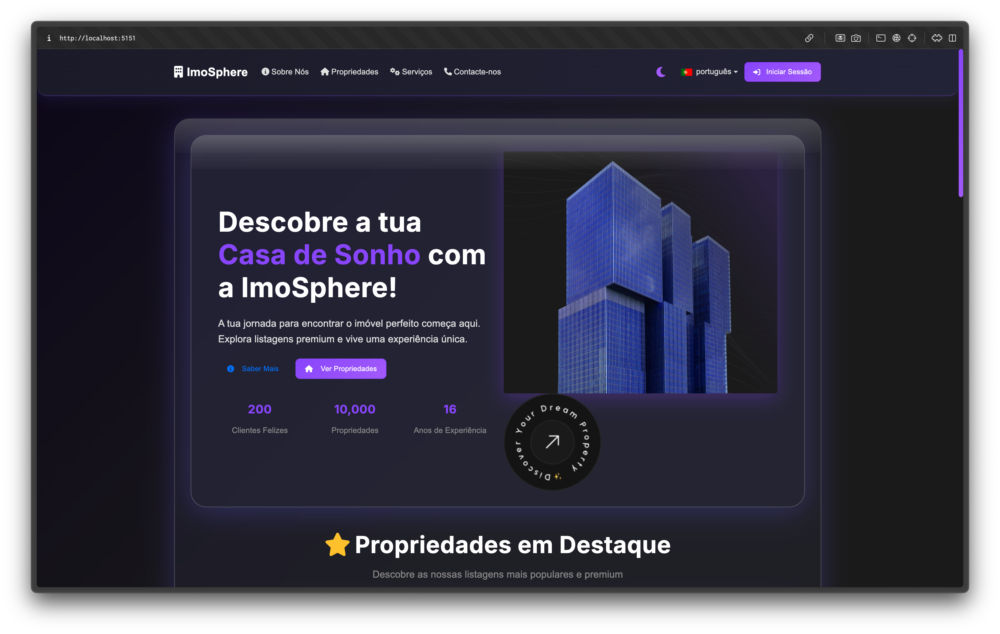
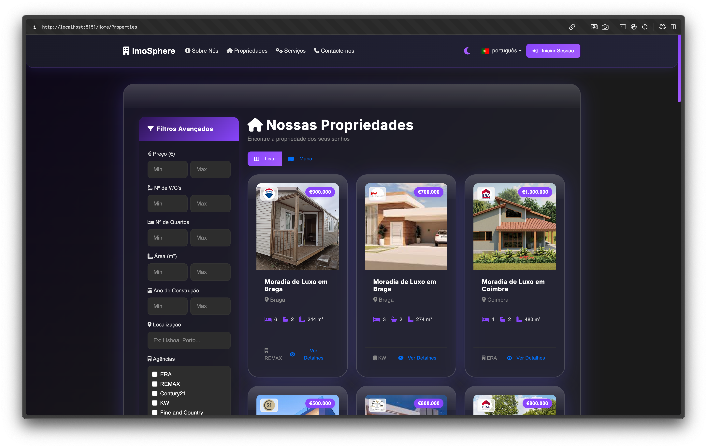
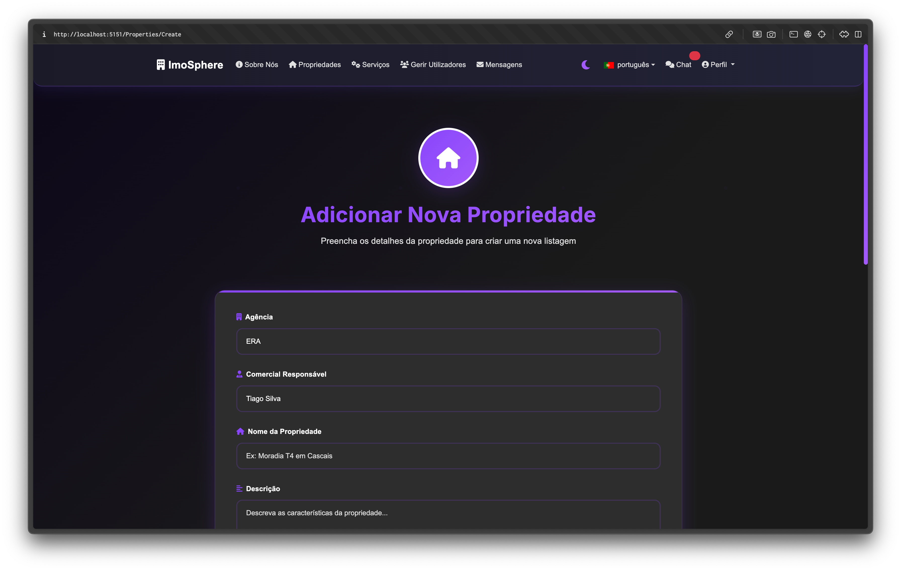
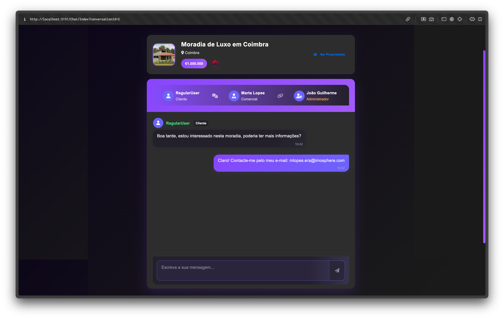

# 🏠 ImoSphere - Plataforma de Mediação Imobiliária Digital

[](https://dotnet.microsoft.com/)
[](https://docs.microsoft.com/en-us/aspnet/core/)
[](https://www.sqlite.org/)
[](https://getbootstrap.com/)
[](LICENSE)

> **Plataforma web completa para mediação imobiliária com gestão de propriedades, utilizadores e comunicação integrada.**

[📖 Manual do Utilizador](/MANUAL_UTILIZADOR.md) | [📖 Manual do Utilizador (PDF)](/UserManual_ImoSphere.pdf) | [🔧 Manual Técnico](/MANUAL_TECNICO.md)

## 📋 Índice

- [🏢 Sobre o Projeto](#-sobre-o-projeto)
- [✨ Funcionalidades](#-funcionalidades)
- [🛠️ Tecnologias](#️-tecnologias)
- [🚀 Instalação](#-instalação)
- [⚙️ Configuração](#️-configuração)
- [👥 Tipos de Utilizador](#-tipos-de-utilizador)
- [🔑 Contas de Teste](#-contas-de-teste)
- [📱 Screenshots](#-screenshots)
- [👨‍💻 Equipa](#-equipa)

## 🏢 Sobre o Projeto

A **ImoSphere** é uma plataforma web desenvolvida em **ASP.NET Core MVC** que facilita a mediação imobiliária digital. A aplicação oferece uma experiência completa para navegação, visualização e gestão de propriedades, com diferentes níveis de acesso baseados no tipo de utilizador.

### 🎯 Objetivos

- **Gestão de Propriedades**: Criação, edição e eliminação de listagens imobiliárias
- **Sistema de Utilizadores**: Hierarquia de permissões (SuperAdmin, Admin, Comercial, User)
- **Comunicação Integrada**: Sistema de mensagens e chat em tempo real
- **Interface Responsiva**: Design moderno e adaptável a todos os dispositivos
- **Gestão de Agências**: Suporte a múltiplas agências imobiliárias

## ✨ Funcionalidades

### 🔍 Exploração de Propriedades
- **Listagem Completa**: Visualização de todas as propriedades disponíveis
- **Filtros Avançados**: Por preço, localização, quartos, área, etc.
- **Detalhes Completos**: Informações detalhadas com galeria de imagens
- **Mapa Interativo**: Localização geográfica com OpenStreetMap

### 👤 Sistema de Utilizadores
- **Registo e Login**: Sistema de autenticação seguro
- **Perfis Personalizados**: Diferentes níveis de acesso
- **Gestão de Utilizadores**: Criação, edição e eliminação (Admin)
- **Hierarquia de Agências**: Gestão de comerciais por agência

### 💬 Comunicação
- **Chat em Tempo Real**: Sistema de mensagens com SignalR
- **Formulário de Contacto**: Comunicação direta com a plataforma
- **Gestão de Mensagens**: Marcação como lidas e eliminação

### 🏗️ Gestão de Conteúdo
- **Upload de Imagens**: Suporte a múltiplas imagens por propriedade
- **Validação de Dados**: Verificação automática de formulários
- **Notificações**: Feedback visual para todas as ações
- **Auto-save**: Guarda automática de rascunhos

## 🛠️ Tecnologias

### Backend
- **ASP.NET Core 8.0** - Framework web
- **Entity Framework Core** - ORM para base de dados
- **SQLite** - Base de dados relacional
- **SignalR** - Comunicação em tempo real
- **Identity Framework** - Autenticação e autorização

### Frontend
- **Bootstrap 5.3** - Framework CSS responsivo
- **jQuery** - Manipulação do DOM
- **Font Awesome** - Ícones
- **Leaflet.js** - Mapas interativos
- **OpenStreetMap** - Serviço de mapas

### Ferramentas de Desenvolvimento
- **Visual Studio 2022** / **VS Code**
- **Git** - Controlo de versões
- **Entity Framework Tools** - Migrações de base de dados

## 🚀 Instalação

### Pré-requisitos
- [.NET 8.0 SDK](https://dotnet.microsoft.com/download/dotnet/8.0)
- [Visual Studio 2022](https://visualstudio.microsoft.com/) ou [VS Code](https://code.visualstudio.com/)
- [Git](https://git-scm.com/)

### Passos de Instalação

1. **Clone o repositório**
   ```bash
   git clone https://github.com/Alex202200037/ImoSphere.git
   cd ImoSphere
   ```

2. **Restaurar dependências**
   ```bash
   dotnet restore
   ```

3. **Configurar a base de dados**
   ```bash
   dotnet ef database update
   ```

4. **Executar a aplicação**
   ```bash
   # Modo normal
   dotnet run
   
   # Modo desenvolvimento (hot reload)
   dotnet watch
   
   # Usar scripts (se disponíveis)
   ./run.sh      # Modo normal
   ./watch.sh    # Hot reload
   ```

5. **Aceder à aplicação**
   ```
   https://localhost:5151
   ```

## ⚙️ Configuração

### Base de Dados
A aplicação utiliza SQLite por padrão. O ficheiro `appsettings.json` contém a configuração:

```json
{
  "ConnectionStrings": {
    "DefaultConnection": "Data Source=ImoSphereDb.db"
  }
}
```

### Variáveis de Ambiente
Para produção, configure as seguintes variáveis:
- `ASPNETCORE_ENVIRONMENT`: `Production`
- `ConnectionStrings__DefaultConnection`: String de conexão da base de dados

### Migrações
Para atualizar o esquema da base de dados:
```bash
dotnet ef migrations add NomeDaMigracao
dotnet ef database update
```

### 🧪 Testes
A aplicação inclui uma suite completa de testes unitários:

```bash
# Executar todos os testes
dotnet test Tests/ImoSphere.Tests.csproj

# Executar testes específicos
dotnet test Tests/ImoSphere.Tests.csproj --filter "FullyQualifiedName~HomeController"

# Usar script de testes
./test.sh
```

**Tipos de Testes:**
- **Controllers**: Testes de endpoints e lógica de negócio
- **Base de Dados**: Testes de relacionamentos e operações CRUD
- **Autenticação**: Mock de utilizadores e verificação de roles

## 👥 Tipos de Utilizador

### 🎯 Utilizador Não Registado (Convidado)
- ✅ Explorar propriedades
- ✅ Aceder a páginas informativas
- ✅ Ver listagens básicas
- ❌ Detalhes completos de propriedades
- ❌ Sistema de mensagens

### 👤 Utilizador Registado (User)
- ✅ Todas as funcionalidades do convidado
- ✅ Detalhes completos de propriedades
- ✅ Sistema de mensagens
- ✅ Chat em tempo real
- ❌ Gestão de propriedades

### 🏠 Comercial (Seller)
- ✅ Todas as funcionalidades do User
- ✅ Criar propriedades
- ✅ Editar propriedades próprias
- ✅ Upload de imagens
- ✅ Gestão de listagens

### 👨‍💼 Administrador (Admin)
- ✅ Todas as funcionalidades do Comercial
- ✅ Gestão de utilizadores
- ✅ Gestão de todas as propriedades
- ✅ Sistema de mensagens administrativo
- ✅ Gestão de agências

### 🔧 Super Administrador (SuperAdmin)
- ✅ Todas as funcionalidades do Admin
- ✅ Gestão de agências
- ✅ Criação de administradores
- ✅ Controlo total da plataforma

### 🔑 Contas de Teste

#### 👑 Super Administrador
| Email                             | Password      |
|-----------------------------------|---------------|
| **imosphere.admin@imosphere.com** | Imosphere@123 |

#### 👨‍💼 Administradores por Agência
| Agência           | Email                          | Password   |
|-------------------|------------------------------- |----------- |
| **ERA**           | jguilherme.era@imosphere.com   | Admin@123  |
| **REMAX**         | candrade.remax@imosphere.com   | Admin@123  |
| **Century21**     | mramos.century21@imosphere.com | Admin@123  |
| **KW**            | vnunes.kw@imosphere.com        | Admin@123  |
| **Fine and Country** | afaria.fac@imosphere.com    | Admin@123  |

#### 🏠 Comerciais por Agência
| Agência           | Email                            | Password      |
|-------------------|--------------------------------- |-------------- |
| **ERA**           | tsilva.era@imosphere.com         | Comercial@123 |
| **ERA**           | mlopes.era@imosphere.com         | Comercial@123 |
| **ERA**           | rcosta.era@imosphere.com         | Comercial@123 |
| **REMAX**         | apereira.remax@imosphere.com     | Comercial@123 |
| **REMAX**         | psousa.remax@imosphere.com       | Comercial@123 |
| **Century21**     | smartins.century21@imosphere.com | Comercial@123 |
| **Century21**     | balves.century21@imosphere.com   | Comercial@123 |
| **KW**            | rpinto.kw@imosphere.com          | Comercial@123 |
| **KW**            | hcruz.kw@imosphere.com           | Comercial@123 |
| **Fine and Country** | pdias.fac@imosphere.com       | Comercial@123 |
| **Fine and Country** | lamaral.fac@imosphere.com     | Comercial@123 |

#### 👤 Utilizador Regular
| Email                  | Password   |
|------------------------|----------- |
| **user@imosphere.com** | User@123   |

## 📱 Screenshots

### Página Inicial


### Listagem de Propriedades


### Formulário de Criação


### Sistema de Chat


## 👨‍💻 Equipa

### Desenvolvedores

| Nome | Número | Email |
|------|--------|-------|
| **Alexandre Miguel** | 202200037 | 202200037@estudantes.ips.pt |
| **Bruna Rossa** | 202200603 | 202200603@estudantes.ips.pt |

### Instituição
- **Instituto Politécnico de Setúbal (IPS) - Escola Superior de Tecnologia de Setúbal (ESTSetúbal)**


---

<div align="center">
  <p>Desenvolvido com ❤️ pela equipa <strong>ImoSphere</strong></p>
  <p><strong>Unidade Curricular:</strong> Programação Visual</p>
  <p><strong>Docente:</strong> José Cordeiro</p>
</div>
